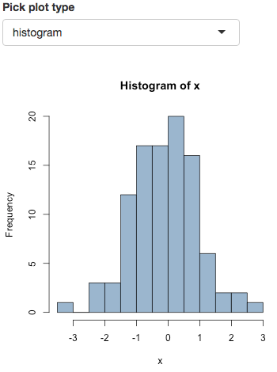

```{r setup, include=FALSE}
library(knitr)
opts_knit$set(
	message = FALSE,
	warning = FALSE,
	echo    = FALSE,
	cache   = TRUE,
	fig.align="center")
options(htmltools.dir.version = FALSE)
library(dplyr)
library(tidyr)
library(purrr)
library(coalitions)
library(stringr)
library(ggplot2)
theme_set(theme_bw())
library(ggridges)
surveys <- get_surveys()


# paty colors
.party_cols_de <- c(
	"cdu"     = "black",
	"spd"     = "#E3000F",
	"greens"  = "#46962b",
	"fdp"     = "#eec900",
	"left"    = "#cd1076",
	"pirates" = "brown",
	"afd"     = "skyblue",
	"others"  = "grey")
```

background-image: url("image/Koala_Logo_Schrift_hell.png")
background-position: 97% 2%
background-size: 150px
class: inverse
# Outline
<hr style='border:solid darkgray 1px; height:0px; margin-top:-20px; margin-bottom:50px'/>

- Motivation

--

- Implementation (Backend)

--

- Implementation (Frontend)

--

- Outlook & sources


---
background-color: whitesmoke
background-image: url("image/Koala_Logo_Schrift.png")
background-position: 97% 2%
background-size: 150px
# Motivation
<hr style='border:solid gray 1px; height:0px; margin-top:-20px; margin-bottom:25px'/>
When covering the election, media outlets (TV and print) mostly focus on
questions like


> Which parties will pass the 5% threshold and enter the "Bundestag" (German parliament)?

and

> Which parties will form the governing coalition
(currently Union - SPD, so called *grand coalition*)?

For the 2017 election also of special interest

> Which party will have the 3rd largest share of votes?


---
background-color: whitesmoke
background-image: url("image/Koala_Logo_Schrift.png")
background-position: 97% 2%
background-size: 150px
# Motivation
To answer these questions, pundits and writers usually focus on raw voting intention polls:
&nbsp;
&nbsp;
&nbsp;

> "Which party would you vote for if election was today?"

&nbsp;
&nbsp;

```{r, warning=FALSE, echo=FALSE}
latest <- coalitions:::get_latest() %>%
	select(-start, -end) %>%
	unnest() %>%
	select(-votes) %>%
	mutate(
		party   = coalitions:::prettify_en(party),
		percent = paste0(percent, "%"))
# kable(latest, format="html", align=c("lrrlr"))
forsa_tab1 <- readRDS("forsa_tab_1.Rds")
kable(forsa_tab1, format="html", caption="Last FORSA poll before the 2013 election (September, 20th); n = 1995", align="rrrrrrr")
```

---
background-color: whitesmoke
background-image: url("image/Koala_Logo_Schrift.png")
background-position: 97% 2%
background-size: 150px
# Motivation
<hr style='border:solid gray 1px; height:0px; margin-top:-20px; margin-bottom:25px'/>
Interpretation of raw polls is problematic for several reasons

1. Sample uncertainty is ignored (even if the sample is representative, we would
expect individual polls to deviate from the true shares).
  - Exhibit 1.a: <a href="https://twitter.com/btwahltrend/status/905031505671585793"> pollytix - Koalitionsrechner</a>
  - Exhibit 1.b: <a href="https://twitter.com/tagesschau/status/910485863649472512">
	Tagesschau </a>

2. Redistribution of votes is ignored (all votes for parties that do not
pass the 5% threshold are redistributed proportionally to parties that pass
the threshold).
  - Exhibit 2: <a href="http://www.faz.net/aktuell/politik/bundestagswahl/bundestagswahl-schwarz-gelb-verliert-die-mehrheit-15143172.html">FAZ</a>

3. Overreaction to individual polls (Some polls can be "off" or only depict
the voting intention in a very short time-period; different weighting methods
used by different pollsters)
  - see Exhibits 1.b and 2

---
background-color: whitesmoke
background-image: url("image/Koala_Logo_Schrift.png")
background-position: 97% 2%
background-size: 150px
# Example: BTW13
<hr style='border:solid gray 1px; height:0px; margin-top:-20px; margin-bottom:25px'/>
```{r echo=FALSE, results="asis", fig.width=8, fig.height=5, fig.align = "center", message=FALSE}
forsa_13 <- readRDS("forsa_13.Rds") %>%
	mutate(
		party = factor(party, levels=party, labels=coalitions:::prettify_en(party)) ,
		percent = round(percent * 100, 1))
forsa_tab1 <- readRDS("forsa_tab_1.Rds")
kable(forsa_tab1, format="html", caption="Last FORSA poll before the 2013 election (September, 20th); n = 1995", align="rrrrrrr")

names(.party_cols_de) <- coalitions:::prettify_en(names(.party_cols_de))
ggplot(forsa_13,
	aes(x=party, y=percent, fill=party)) +
	geom_bar(stat="identity") +
	scale_fill_manual(values=.party_cols_de) +
	geom_hline(yintercept = 5, lwd=1.2, col="grey80") +
	theme(
		legend.position = "none",
		axis.text=element_text(size=rel(1.5))) +
	xlab("") + ylab("") +
	scale_y_continuous(labels= function(x) paste0(x, "%")) +
	ylim(c(0, 50))
```


---
background-color: whitesmoke
background-image: url("image/Koala_Logo_Schrift.png")
background-position: 97% 2%
background-size: 150px
# Example: BTW13
<hr style='border:solid gray 1px; height:0px; margin-top:-20px; margin-bottom:25px'/>
Taking this poll at face value, 10% of votes would be redistributed:
&nbsp;
&nbsp;

```{r echo=FALSE, message=FALSE, results="asis", fig.align="center", fig.height=5, fig.width=7}
frd_13 <- readRDS("forsa_redist_13.Rds")
tab <- frd_13 %>%
	select(-seats) %>%
  mutate(
    share = str_pad(paste0(share, "%"), 3)) %>%
  spread(party, share)
kable(tab, format="html", align="rrrrrrr")
ggplot(frd_13,
	aes(x=party, y=share, fill=party)) +
	geom_bar(stat="identity") +
	scale_fill_manual(values=.party_cols_de) +
	theme(
		legend.position = "none",
		axis.text=element_text(size=rel(1.5))) +
	xlab("") + ylab("") +
	scale_y_continuous(labels= function(x) paste0(x, "%"), limits = c(0, 50))
```


---
background-color: whitesmoke
background-image: url("image/Koala_Logo_Schrift.png")
background-position: 97% 2%
background-size: 150px
# Example: BTW13
<hr style='border:solid gray 1px; height:0px; margin-top:-20px; margin-bottom:25px'/>
- This still ignores the sample uncertainty
- Therefore, we sample election outcomes from the Dirichlet distribution

```{r, eval=FALSE}
forsa_13$percent
round(gtools::rdirichlet(3, 1995*forsa_13$percent+0.5), 4)
```
```
##        [,1]   [,2]   [,3]   [,4]   [,5]   [,6]   [,7]   [,8]
## [1,] 0.4022 0.2634 0.1014 0.0439 0.0894 0.0157 0.0425 0.0414
## [2,] 0.4206 0.2526 0.0915 0.0446 0.0949 0.0210 0.0336 0.0413
## [3,] 0.4152 0.2629 0.0965 0.0518 0.0872 0.0154 0.0356 0.0353
```
```{r, eval=FALSE}
round(gtools::rdirichlet(3, 20*forsa_13$percent+0.5), 4)
```
```
##        [,1]   [,2]   [,3]   [,4]   [,5]   [,6]   [,7]   [,8]
## [1,] 0.4861 0.2415 0.0551 0.0123 0.0663 0.0148 0.0969 0.0270
## [2,] 0.2443 0.1557 0.2510 0.1100 0.0548 0.0205 0.0898 0.0738
## [3,] 0.4347 0.2295 0.0750 0.1335 0.0505 0.0016 0.0732 0.0021
```

---
background-color: whitesmoke
background-image: url("image/Koala_Logo_Schrift.png")
background-position: 97% 2%
background-size: 150px
# Example: BTW13
<hr style='border:solid gray 1px; height:0px; margin-top:-20px; margin-bottom:25px'/>
- Based on a simulation with $n=10000$, FDP would not pass the 5% threshold in 50% of the cases
- This leads to a bimodal distribution (after redistribution)

```{r echo=FALSE, message=FALSE, fig.align="center", fig.width=7.8, fig.height=6}
seats <- readRDS("forsa_seats_13.Rds")
seats_coalition <- seats %>%
	filter(party %in% c("cdu", "fdp")) %>%
	spread(party, seats, fill=0) %>%
	group_by(sim) %>%
	mutate(
		"Union|FDP" = sum(cdu, fdp),
		FDPout = fdp == 0) %>%
	rename(Union = cdu, FDP = fdp) %>%
	gather(party, percent, -sim, -FDPout) %>%
	mutate(percent = percent/598 * 100)
ggplot(seats_coalition, aes(x=percent, group=FDPout, fill=FDPout)) +
	geom_density(bw=0.2, alpha=0.5) +
	# geom_vline(xintercept = 50, lwd=1.1, col="grey80") +
	facet_wrap(~party, scales="free_x")  +
	scale_fill_manual(
		breaks = c(TRUE, FALSE),
		labels = c("No", "Yes"),
		values = rev(c("darkred", "deepskyblue2")),
		name   = "FDP above 5% threshold") +
	xlab("") + ylab("") +
	scale_x_continuous(labels=function(x) paste0(x, "%")) +
	theme(
		legend.position = "bottom",
		legend.text     = element_text(size = rel(1.2)),
		legend.title    = element_text(size = rel(1.3)),
		axis.text       = element_text(size = rel(1.3)),
		strip.text      = element_text(size = rel(1.3)))
```

---
background-color: whitesmoke
background-image: url("image/Koala_Logo_Schrift.png")
background-position: 97% 2%
background-size: 150px
# Example: BTW13
<hr style='border:solid gray 1px; height:0px; margin-top:-20px; margin-bottom:25px'/>

- Coalition probabilities can be obtained by calculating the area underneath
the probability distribution for $x> 50%$
- Or simpler: $P(\text{event}|\text{sample})=\frac{\# \text{simulations with event}}{\# \text{simulations}}$

```{r echo=FALSE, fig.align="center", fig.width=5, fig.height=5, message=FALSE}
ggplot(filter(seats_coalition, party=="Union|FDP"), aes(x=percent, y=0)) +
	geom_density_ridges_gradient(aes(fill=..x..>50)) +
	geom_vline(xintercept = 50, lwd=1.1, col="grey80") +
	scale_fill_manual(
		breaks = c(FALSE,TRUE),
		labels = c("No", "Yes"),
		values = c("grey70", "steelblue"),
		name   = "Votes share Union|FDP > 50%") +
	xlab("") + ylab("") +
	scale_x_continuous(labels=function(x) paste0(x, "%")) +
	theme(
		legend.position = "bottom",
		legend.text     = element_text(size = rel(1.2)),
		legend.title    = element_text(size = rel(1.3)),
		axis.text       = element_text(size = rel(1.3)),
		strip.text      = element_text(size = rel(1.3)))
```


---
background-color: whitesmoke
background-image: url("image/Koala_Logo_Schrift.png")
background-position: 97% 2%
background-size: 150px
# KOALA: Coalitions Analysis
<hr style='border:solid gray 1px; height:0px; margin-top:-20px; margin-bottom:25px'/>
In [our approach](http://www.stablab.stat.uni-muenchen.de/forschung/koala/methodik.pdf) we
- aggregate polls from different pollsters within a 14-day time-window
(pooled survey)

- Calculate the Posterior Dirichlet distribution (based on Multinomial Likelihood
and flat/uninformative Dirichlet Prior)

- Calculate "secondary" properties (e.g. probability that Union-FDP would have simple majority) via Monte-Carlo sampling

	- Simulate election outcomes from known Posterior (based on current pooled survey)

	- $P(\text{event}|sample) = \frac{\# \text{event}}{\text{number of simulations}}$


---
background-color: whitesmoke
background-image: url("image/Koala_Logo_Schrift.png")
background-position: 97% 2%
background-size: 150px
# Implementation (Backend)
<hr style='border:solid gray 1px; height:0px; margin-top:-20px; margin-bottom:25px'/>
- Backend implemented in the R-package `coalitions`
	(see [Workflow vignette](https://adibender.github.io/coalitions/articles/workflow.html))

	- scrapes wahlrecht.de for (new) polls

	- (calculates *pooled* sample)

	- calculate and sample from Posteriori

	- Redistribute votes below 5% threshold and calculate Seats based on
	method by [Sainte-Lague-Scheppers](http://www.wahlrecht.de/verfahren/rangmasszahlen.html) (German Law)

	- Calculate coalition probabilities

---
background-color: whitesmoke
background-image: url("image/Koala_Logo_Schrift.png")
background-position: 97% 2%
background-size: 150px
# Implementation (Backend)
<hr style='border:solid gray 1px; height:0px; margin-top:-20px; margin-bottom:25px'/>
- Install via
```{r, eval=FALSE}
devtools::install_github("adibender/coalitions")
```

- Surveys returned as *nested* tidy data set (`tibble`)
```{r getSurveys, cache=TRUE, warning=FALSE}
surveys <- get_surveys()
surveys
```

---
background-color: whitesmoke
background-image: url("image/Koala_Logo_Schrift.png")
background-position: 97% 2%
background-size: 150px
# Implementation (Backend)
<hr style='border:solid gray 1px; height:0px; margin-top:-20px; margin-bottom:25px'/>
```{r, dependson="getSurveys"}
surveys %>%
	unnest() %>%
	select(-start, -end)
```

---
background-color: whitesmoke
background-image: url("image/Koala_Logo_Schrift.png")
background-position: 97% 2%
background-size: 150px
# Implementation (Backend)
<hr style='border:solid gray 1px; height:0px; margin-top:-20px; margin-bottom:25px'/>
```{r dependson="getSurveys"}
surveys %>%
	unnest() %>%
	slice(1) %>%
	unnest() %>%
	select(-start, -end)
```

---
background-color: whitesmoke
background-image: url("image/Koala_Logo_Schrift.png")
background-position: 97% 2%
background-size: 150px
<!-- # Implementation (Backend) -->
### pooled survey
<hr style='border:solid gray 1px; height:0px; margin-top:-20px; margin-bottom:25px'/>
```{r, dependson="getSurveys"}
pooled_survey <- surveys %>% pool_surveys()
pooled_survey %>% select(-start, -end)
```

---
background-color: whitesmoke
background-image: url("image/Koala_Logo_Schrift.png")
background-position: 97% 2%
background-size: 150px
### Draw from Posterior
<hr style='border:solid gray 1px; height:0px; margin-top:-20px; margin-bottom:25px'/>
```{r dependson="getSurveys"}
draws <- pooled_survey  %>%
	draw_from_posterior(seed=123)
draws[1:6, ]
## calculate probabilities to pass 5% threshold
draws %>% summarize_all(funs(mean(.>0.05)))
```

---
background-color: whitesmoke
background-image: url("image/Koala_Logo_Schrift.png")
background-position: 97% 2%
background-size: 150px
### Redistribution and seats calculation
<hr style='border:solid gray 1px; height:0px; margin-top:-20px; margin-bottom:25px'/>
```{r seats, dependson="getSurveys", cache=TRUE}
seats <- get_seats(draws, pooled_survey, distrib.fun=sls, hurdle=0.05)
seats
```

---
background-color: whitesmoke
background-image: url("image/Koala_Logo_Schrift.png")
background-position: 97% 2%
background-size: 150px
### Calculate coalition probabilities
<hr style='border:solid gray 1px; height:0px; margin-top:-20px; margin-bottom:25px'/>
```{r probs, dependson="getSurveys"}
probs <- seats %>% have_majority() %>%
	calculate_probs(coalitions=list(c("cdu", "fdp"), c("cdu", "fdp", "greens")))
probs
```

---
background-color: whitesmoke
background-image: url("image/Koala_Logo_Schrift.png")
background-position: 97% 2%
background-size: 150px
### Wrapper
<hr style='border:solid gray 1px; height:0px; margin-top:-20px; margin-bottom:25px'/>
```{r dependson="getSurveys", cache=TRUE}
set.seed(123)
pooled_survey %>%
	nest(party:votes, .key="survey") %>%
	get_probabilities(seed=123) %>%
	unnest()
```

---
background-color: whitesmoke
background-image: url("image/Koala_Logo_Schrift.png")
background-position: 97% 2%
background-size: 150px
# Visualization
<hr style='border:solid gray 1px; height:0px; margin-top:-20px; margin-bottom:25px'/>
- We visualize the posterior via "ridgeline plots" ([formerly Joy plots](http://serialmentor.com/blog/2017/9/15/goodbye-joyplots))

- Uses `ggplot`, `ggridges`, `gganimate`
- (click <a href="test-joy.gif">here</a> for animated version; also featured
at [Spektrum.de](http://www.spektrum.de/news/koennen-die-aktuellen-umfragen-noch-falschliegen/1503163))

<a href="test-joy-static.jpeg" align="middle">
	
</a>


---
background-color: whitesmoke
background-image: url("image/Koala_Logo_Schrift.png")
background-position: 97% 2%
background-size: 150px
# Joy/Ridges-Plot (Implementation)
<hr style='border:solid gray 1px; height:0px; margin-top:-20px; margin-bottom:25px'/>
```{r, eval=FALSE}
gg_distrb <- ggplot(schw_gelb, aes(x = percent, y = date2,
	group=date2, frame=date, cumulative=TRUE, fill=..x..>50)) +
	geom_density_ridges_gradient(scale = 10, size = 0.25) +
	geom_vline(xintercept = 50, lty=1, lwd=1.2, col="grey90") +
	scale_fill_manual(
		name   = "Rechnerische Sitzemehrheit",
		breaks = c("FALSE", "TRUE"),
		labels = c("Nein", "Ja"),
		values = c("#d1d0ce", "steelblue") ) +
	theme(legend.position = "bottom")  +
	scale_x_continuous(labels = function(x) paste0(x, "%")) +
	scale_y_continuous(trans = rev_date) +
	guides(fill=guide_legend(override.aes=list(alpha=1))) +
	theme(
		axis.text    = element_text(size = rel(1.3)),
		axis.title.y = element_blank(),
		axis.title.x = element_blank(),
		legend.text  = element_text(size = rel(1.2)),
		legend.title = element_text(size = rel(1.3))) +
	labs(
		title = "Wahrscheinlichkeitsverteilung der Stimmanteile für Union - FDP",
		subtitle = "(seit Oktober 2016)")
```

---
background-color: whitesmoke
background-image: url("image/Koala_Logo_Schrift.png")
background-position: 97% 2%
background-size: 150px
# Joy/Ridges-Plot (Implementation)
<hr style='border:solid gray 1px; height:0px; margin-top:-20px; margin-bottom:25px'/>
```{r, eval=FALSE}
gg_distrb <- ggplot(schw_gelb, aes(x = percent, y = date,
	group=date, frame=date, cumulative=TRUE, fill=..x..>50)) +
   geom_density_ridges_gradient(scale = 10, size = 0.25) +
	# geom_vline(xintercept = 50, lty=1, lwd=1.2, col="grey90") +
	# scale_fill_manual(
	# 	name   = "Rechnerische Sitzemehrheit",
	# 	breaks = c("FALSE", "TRUE"),
	# 	labels = c("Nein", "Ja"),
	# 	values = c("#d1d0ce", "steelblue") ) +
	# theme(legend.position = "bottom")  +
	# scale_x_continuous(labels = function(x) paste0(x, "%")) +
	# scale_y_continuous(trans = rev_date) +
	# guides(fill=guide_legend(override.aes=list(alpha=1))) +
	# theme(
	# 	axis.text    = element_text(size = rel(1.3)),
	# 	axis.title.y = element_blank(),
	# 	axis.title.x = element_blank(),
	# 	legend.text  = element_text(size = rel(1.2)),
	# 	legend.title = element_text(size = rel(1.3))) +
	# labs(
	# 	title = "Wahrscheinlichkeitsverteilung der Stimmanteile für Union - FDP",
	# 	subtitle = "(seit Oktober 2016)")
```

---
background-color: whitesmoke
background-image: url("image/Koala_Logo_Schrift.png")
background-position: 97% 2%
background-size: 150px
# Animation
<hr style='border:solid gray 1px; height:0px; margin-top:-20px; margin-bottom:25px'/>
- **If you're able to `ggplot`, you are able to `gganimate`!**
- The **`gganimate`** package currently not on CRAN, install via:
```{r, eval=FALSE}
devtools::install_github("drgtwo/gganimate")
```

```{r, eval=FALSE}
library(ggplot2)
library(ggridges)
library(gganimate)
gg_distrb <- ggplot(schw_gelb, aes(x = percent, y = date,
 		group=date, frame=date, cumulative=TRUE, fill=..x..>50)) +
	geom_density_ridges_gradient(scale = 10, size = 0.25)
gganimate(gg_distrb, "output.gif", interval=.2, ani.width=600)
```

- Set GIF parameters (width, height, etc. via `ani.options`)
- Control speed of the animation via `interval` argument </br>
(lower values $\rightarrow$ higher speed)
- Don't forget to set the `frame` argument in the call to `ggplot` (this is
the variable over which the animation will iterate)
- By setting `cumulative=TRUE` current frame also contains previous frames
- Note: `alpha` argument does not work with `*_gradient` geoms


---
background-image: url("image/Koala_Logo_Schrift_hell.png")
background-position: 97% 2%
background-size: 150px
class: inverse
# Frontend implementation
<hr style='border:solid darkgray 1px; height:0px; margin-top:-20px; margin-bottom:50px'/>

1) Creating a homepage with Shiny

2) Setting up the server with Shiny Server

3) APIs and stuff: tweetR and googlesheets

4) Keep the website running

---
class: inverse
<iframe src='http://koala.stat.uni-muenchen.de' style='width:100%; height:96%'/>


---
background-color: whitesmoke
background-image: url("image/Koala_Logo_Schrift.png")
background-position: 97% 2%
background-size: 150px
# Frontend - Shiny
<hr style='border:solid gray 1px; height:0px; margin-top:-20px; margin-bottom:25px'/>

Shiny in a nutshell:
- R package by RStudio

- Web application framework

- Creation of interactive dashboards, running R in the background

- Resources: <a href='https://www.meetup.com/de-DE/Applied-R-Munich/events/226912554/' target='_blank'>Applied R Shiny Meetup</a>,  <a href='http://shiny.rstudio.com/' target='_blank'>shiny.rstudio.com</a>

- Tip: Use <a href='https://rstudio.github.io/shinydashboard/' target='_blank'>shinydashboard</a> for a more appealing dashboard UI

--

<br/>
Why Shiny?

- Easy integration of interactive R output and calculations

- No need for learning another language, Shiny creates the HTML, CSS and JavaScript for you!


---
background-color: whitesmoke
background-image: url("image/Koala_Logo_Schrift.png")
background-position: 97% 2%
background-size: 150px
# Frontend - Shiny
<hr style='border:solid gray 1px; height:0px; margin-top:-20px; margin-bottom:25px'/>




---
background-color: whitesmoke
background-image: url("image/Koala_Logo_Schrift.png")
background-position: 97% 2%
background-size: 150px
# Frontend - Shiny
<hr style='border:solid gray 1px; height:0px; margin-top:-20px; margin-bottom:25px'/>

```R
library(shiny)


ui <- fluidPage(
  selectInput("plotType_picker", "Pick plot type",
              choices = c("boxplot","histogram")),
  plotOutput("my_plot")
)
server <- function(input, output) {
  x <- rnorm(100)
  output$my_plot <- renderPlot({
    if (input$plotType_picker == "boxplot") {
      boxplot(x)
    } else
      hist(x)
  })
}


shinyApp(ui = ui, server = server)
```


---
background-color: whitesmoke
background-image: url("image/Koala_Logo_Schrift.png")
background-position: 97% 2%
background-size: 150px
# Frontend - Shiny Server
<hr style='border:solid gray 1px; height:0px; margin-top:-20px; margin-bottom:25px'/>

Shiny Server in a nutshell:

- Linux-based open source web server by RStudio

- Access to the homepage starts an R process with a Shiny app on the server


<br/><br/>
Resources:

- <a href='https://www.rstudio.com/products/shiny/shiny-server2/' target='_blank'>Official homepage</a>


---
background-color: whitesmoke
background-image: url("image/Koala_Logo_Schrift.png")
background-position: 97% 2%
background-size: 150px
# Frontend - Shiny Server
<hr style='border:solid gray 1px; height:0px; margin-top:-20px; margin-bottom:25px'/>

Setting up Shiny Server (on 64-bit Ubuntu 12.04+): (<a href='http://docs.rstudio.com/shiny-server/' target='_blank'>administrator's guide</a>)

1) Install R and all needed R packages on the server

2) Install Shiny Server (<a href='https://www.rstudio.com/products/shiny/download-server/' target='_blank'>install guide</a>)
```bash
$ sudo apt-get install gdebi-core
$ sudo wget https://download3.rstudio.org/ubuntu-12.04/x86_64/shiny-server-1.5.3.838-amd64.deb
$ sudo gdebi shiny-server-1.5.3.838-amd64.deb
```

3) Customize the shiny-server.conf file to your needs
  <div style="margin-top:-20px">
  - &nbsp;Tip 1: <p style="font-family:Source Code Pro; display:inline-block">'sanitize_errors false;'</p> gets you clearer error messages
  </div>
  <div style="margin-top:-40px; margin-left:20px">
  - Tip 2: <p style="font-family:Source Code Pro; display:inline-block">'app_idle_timeout 0;'</p> saves startup time of the R process
  </div>

4) Put the Shiny files inside the path specified in shiny.server.conf


---
background-color: whitesmoke
background-image: url("image/Koala_Logo_Schrift.png")
background-position: 97% 2%
background-size: 150px
# Frontend - Shiny Server
<hr style='border:solid gray 1px; height:0px; margin-top:-20px; margin-bottom:25px'/>

Capabilities of the free version (Shiny Server Open Source):

- For non-commercial projects

- Up to 20 users simultaneously

- No multiple R processes! <br/> &#8594; code efficiently and precalculate results where possible


--

<br/>
<a href='https://www.rstudio.com/products/shiny/shiny-server/' target='_blank'>(R-based) alternatives:</a>

- Shiny Server Pro: Commercial use, multiple R processes etc.

- <a href='https://www.shinyapps.io' target='_blank'>shinyapps.io</a>:
  - Deploy Shiny apps on RStudio servers
  - Free version limited to 25 hours of use per month!


---
background-color: whitesmoke
background-image: url("image/Koala_Logo_Schrift.png")
background-position: 97% 2%
background-size: 150px
# Frontend - tweetR 
<hr style='border:solid gray 1px; height:0px; margin-top:-20px; margin-bottom:25px'/>

The tweetR package in a nutshell:

- Our use case: Send tweets with new results

- Resources: <a href='http://geoffjentry.hexdump.org/twitteR.pdf' target='_blank'>user vignette</a>, <a href='https://github.com/geoffjentry/twitteR' target='_blank'>tweetR on GitHub</a>

- Alternative (more modern) package: <a href='http://rtweet.info/' target='_blank'>rtweet</a>


---
background-color: whitesmoke
background-image: url("image/Koala_Logo_Schrift.png")
background-position: 97% 2%
background-size: 150px
# Frontend - tweetR 
<hr style='border:solid gray 1px; height:0px; margin-top:-20px; margin-bottom:25px'/>

Sending a Tweet with tweetR:

1) Register a new Twitter app on <a href='https://apps.twitter.com/' target='_blank'>apps.twitter.com</a>

2) Use the credentials to do the authorization with R
```R
setup_twitter_oauth(consumer_key = "your_consumer_key",
                    consumer_secret = "your_consumer_secret",
                    access_token = "your_access_token",
                    access_secret = "your_access_secret")
```

3) Start tweeting!
```R
tweet(message = "Tweet tweet", mediaPath = "my_picture.png")
```

---
background-color: whitesmoke
background-image: url("image/Koala_Logo_Schrift.png")
background-position: 97% 2%
background-size: 150px
# Frontend - googlesheets 
<hr style='border:solid gray 1px; height:0px; margin-top:-20px; margin-bottom:25px'/>

The googlesheets package in a nutshell:

- Our use case: Offering an API for our results

- Resources: <a href='https://github.com/jennybc/googlesheets' target='_blank'>googlesheets on GitHub</a>


---
background-color: whitesmoke
background-image: url("image/Koala_Logo_Schrift.png")
background-position: 97% 2%
background-size: 150px
# Frontend - googlesheets 
<hr style='border:solid gray 1px; height:0px; margin-top:-20px; margin-bottom:25px'/>

Exporting a table to Google Sheets with googlesheets:

1) Extract your credentials:
```R
auth_info <- gs_auth()
saveRDS(auth_info, file = "auth_info.rds")
```

2) Use the credentials to do the authorization with R
```R
gs_auth(token = "auth_info.rds")
```

3) Start uploading!
```R
my_table <- data.frame("person"      = c("Sepp","Uli","Franz"),
                       "likes_koala" = c("yes", "yes", "yes"))
write.csv(my_table, file = "my_table.csv")
gs_upload("my_table.csv", sheet_title = "my_googleSheet",
          overwrite = TRUE)
```


---
background-color: whitesmoke
background-image: url("image/Koala_Logo_Schrift.png")
background-position: 97% 2%
background-size: 150px
# Frontend - Keep the website running
<hr style='border:solid gray 1px; height:0px; margin-top:-20px; margin-bottom:25px'/>

Automation of the server:

- We check hourly if new surveys are available and update the results

- Implementation: see next slide

- Tip: Automatic error notification using <a href='https://www.pushbullet.com/' target='_blank'>Pushbullet</a> 

  - Supports notifications to all major (Desktop and mobile) systems

  - R package: <a href='https://github.com/eddelbuettel/rpushbullet' target='_blank'>RPushbullet on GitHub</a>


---
background-color: whitesmoke
background-image: url("image/Koala_Logo_Schrift.png")
background-position: 97% 2%
background-size: 150px
<div style='margin-top:-25px'/> <!-- use empty div to create negative vertical spacing -->
### Implementation of the automation process
1) Set up the R script
```R
while (1 < 2) { # do something eternally
  # Step 1: check for new surveys and perform calculations
  update_results()

  # Step 2: Update services with new results
  if (new_results) { # if new results are available
    send_tweet()
    export_googleSheets()

    # restart the server to fetch the new results (on Ubuntu 15.04+)
    system("sudo systemctl restart shiny-server")
  }

  # Step 3: Rest for an hour
  Sys.sleep(60*10)
}
```

2) Start the R script on the server
```bash
R CMD BATCH update_results_everyHour.R &
```


---
background-image: url("image/Koala_Logo_Schrift_hell.png")
background-position: 97% 2%
background-size: 150px
class: inverse
# Outlook & sources
<hr style='border:solid darkgray 1px; height:0px; margin-top:-20px; margin-bottom:50px'/>

1) Future plans

2) Sources


---
background-color: whitesmoke
background-image: url("image/Koala_Logo_Schrift.png")
background-position: 97% 2%
background-size: 150px
# Outlook - Future plans
<hr style='border:solid gray 1px; height:0px; margin-top:-20px; margin-bottom:25px'/>

- Make frontend R package (shiny app) open source

- Simplify data handling, Create online data base (with API), etc.

- Extend the framework to:
  - other elections (regional and international)
  - improve interactive experience
  - make @tagesschau (and others) use our methods!


---
background-color: whitesmoke
background-image: url("image/Koala_Logo_Schrift.png")
background-position: 97% 2%
background-size: 150px
# Sources
<hr style='border:solid gray 1px; height:0px; margin-top:-20px; margin-bottom:25px'/>

General sources:

- Raw voting intention polls: <a href='http://www.wahlrecht.de' target='_blank'>www.wahlrecht.de</a>

- Our slides are powered by <a href='https://slides.yihui.name/xaringan/' target='_blank'>Xaringan</a>

- <a href='https://www.tidyverse.org' target='_blank'>tidyverse</a> (previously hadleyverse)

<br/>
--

How to reach us?

- Visit us on <a href='koala.stat.uni-muenchen.de' target='_blank'>koala.stat.uni-muenchen.de</a>

<!-- - Follow  <a href='https://twitter.com/KOALA_LMU' target='_blank'>@KOALA_LMU</a> on Twitter -->

- Contact us directly: <a href='mailto:koala@stat.uni-muenchen.de'>koala@stat.uni-muenchen.de</a>

- Feel free to contribute on <a href='https://github.com/adibender/coalitions' target='_blank'>GitHub</a>


---
background-color: whitesmoke
background-image: url("image/Koala_Logo_Schrift.png")
background-position: 97% 2%
background-size: 150px
# Preparing for election day
<hr style='border:solid gray 1px; height:0px; margin-top:-20px; margin-bottom:25px'/>

Keep in mind:

- We do not make predictions!

- Many voters (~40%) still undecided

&nbsp;
&nbsp;
&nbsp;
<br/><br/>

--
###  So, stay tuned...
<br/>
... and <a href='https://twitter.com/KOALA_LMU' target='_blank'>follow us on Twitter</a> :-)

